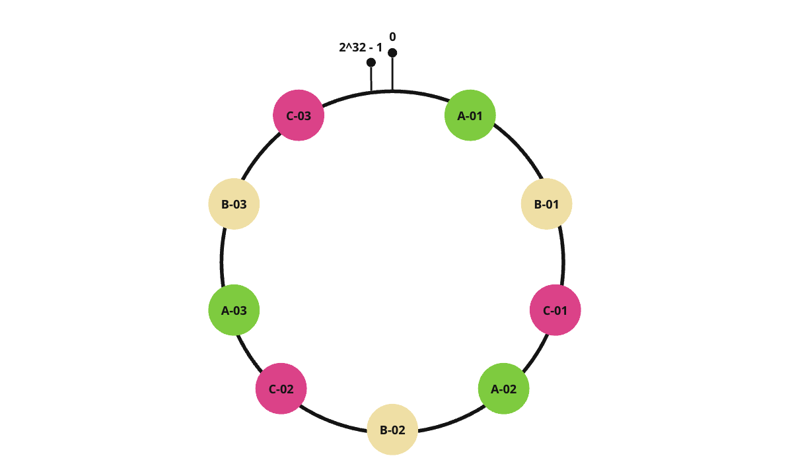

# Consistent Hashing

## Refining Distributed Key-Value Store Strategies

In a Key-Value (K-V) store, we locate values based on the provided key. Assume we have a system with three nodes; the typical data mapping method is hash(key) %3.

Let's illustrate with a distributed KV cache system comprising three nodes: A, B, and C. When we query the data for key-01, key-02, and key-03, their hash function calculations yield hash(key-01) = 6, hash(key-02) = 7, hash(key-03) = 8. We then perform modular operations on these values.

As business scales and we need to increase data storage, we add a node, shifting node count from 3 to 4. This alteration in the modulus base of the hash function changes the mapping relationship, resulting in substantial data migration whenever we expand or contract the distributed system, i.e., add or remove nodes.

## Implementing Consistent Hash Algorithm

The consistent hash algorithm is designed to mitigate the issue of excessive data migration in distributed systems during expansion or contraction. Unlike the traditional hash algorithm that performs the modulus operation on the number of nodes, the consistent hash algorithm employs a fixed modulus operation of 2^32.

We can visualize the outcome of the 2^32 modulus operation as a ring, likened to a clock face, where the circle comprises 2^32 points instead of 60. This ring is known as the 'Hash Ring'.

Initially, we perform a hash operation on the key to pinpoint its mapped position on the hash ring. The first node found in the clockwise direction from this position becomes the key data storage node. When a node is added or removed, it only influences the successor nodes adjacent to it on the hash ring, leaving other data unaffected.

Nevertheless, the consistent hash algorithm doesn't guarantee an even distribution of nodes on the hash ring. This unevenness could result in excessive requests on a single node.

## Enhancing Uniformity with Virtual Nodes

To tackle the issue of uneven node distribution on the hash ring, we could increase the number of nodes. However, practically, it's impossible to have an unlimited number of nodes. Here, we introduce the concept of 'virtual nodes'— multiple replicas of a real node.

We no longer map the real node to the hash ring. Instead, we map the virtual nodes to the hash ring, and then map these virtual nodes back to their corresponding real nodes—creating a two-tier mapping relationship.

Let's consider an example where each node is assigned three virtual nodes:

- Node A has virtual nodes: A-01, A-02, A-03
- Node B has virtual nodes: B-01, B-02, B-03
- Node C has virtual nodes: C-01, C-02, C-03

With the introduction of virtual nodes, instead of having just three nodes on the hash ring, we now have nine virtual nodes mapped onto it, tripling the number of nodes on the hash ring and creating a relatively uniform node distribution. In this scenario, if there's a request addressing virtual node "A-01", it finds the real node A through the "A-01" virtual node, thereby accessing the actual node A.

## Code Test

### Consistent Hashing without virtual nodes

#### Standard Deviation Result

### Consistent Hashing with virtual nodes

Standard Deviation Result with 10 virutual nodes

Standard Deviation Result with 100 virutual nodes

